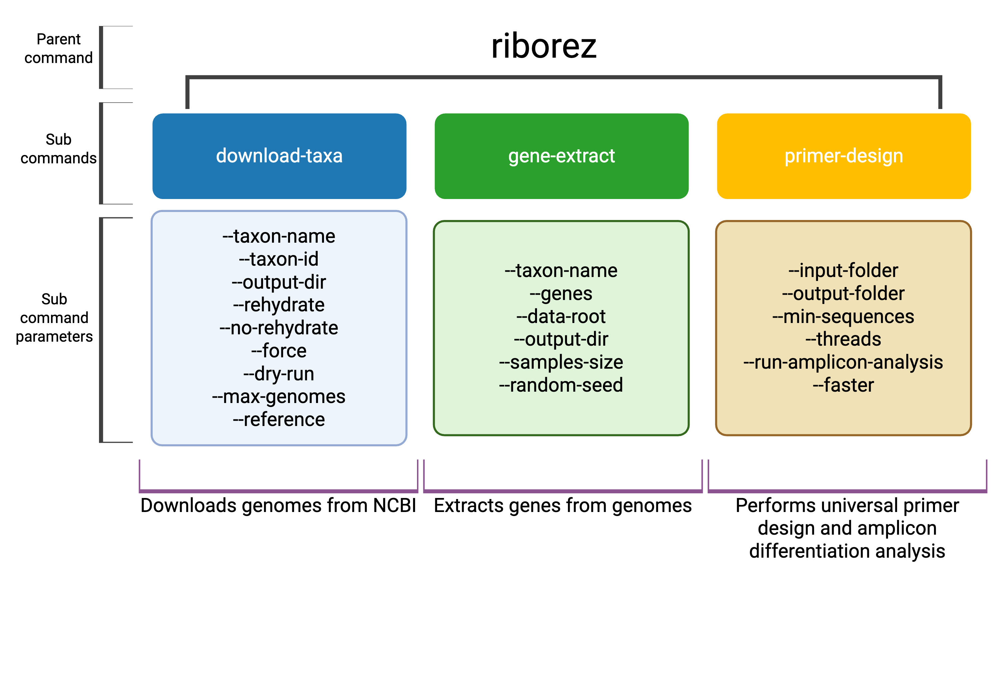

# RiboRez

A tool for exploring mRNA transcripts for taxonomic resolution.



## How It Works

RiboRez is a four-step pipeline. Each step produces output that feeds directly into the next:

```
Step 1: download-taxa  →  {taxon-name}_NCBI/
Step 2: gene-extract   →  {taxon-name}_RNAextracted/
Step 3: primer-design  →  {taxon-name}_Primers/
Step 4: amplicon-analysis  →  {taxon-name}_AmpliconAnalysis/
```

**Important:** `--taxon-name` must be the **same value** in `download-taxa` and `gene-extract`. The `gene-extract` command uses it to automatically locate the folder created by `download-taxa` (e.g., `--taxon-name Pseudomonas` looks for `Pseudomonas_NCBI/`). If you renamed that folder, use `--data-root` to point to it manually.

---

### Command Options

#### download-taxa
- `--taxon-name`: Taxon name used for naming the output folder (e.g., `Pseudomonas` → `Pseudomonas_NCBI/`) [required]
- `--taxon-id`: NCBI Taxon ID [required]
- `--output-dir`: Optional custom output directory
- `--rehydrate`: Rehydrate datasets (default)
- `--no-rehydrate`: Skip rehydration
- `--force`: Overwrite output directory if it exists
- `--dry-run`: Print commands without executing
- `--max-genomes`: Maximum number of genomes to download (default: all available)
- `--assembly-level`: Filter by assembly quality: `complete` (fully assembled, no gaps — recommended), `chromosome`, `scaffold`, or `contig`. Default: all levels.
- `--reference`: Restrict to NCBI-designated reference genomes only (very small curated set, typically 1–5 per species). Use `--assembly-level complete` instead for a broader high-quality set.

#### gene-extract
- `--taxon-name`: Must match the name used in `download-taxa` — used to locate `{taxon-name}_NCBI/` [required]
- `--genes`: Specific genes to extract (default: all genes). Examples: `16S`, `23S`, `rRNA`, `gyrA`, `recA`
- `--data-root`: Manually specify the path to your genome data directory. Supports two layouts:
  - **NCBI dataset format** (default from `download-taxa`): a directory of subdirectories, each containing a FASTA + GFF file
  - **Flat format**: FASTA and GFF files placed directly in the directory. Files are paired by matching stem name (e.g., `genome1.fna` + `genome1.gff`). If only one GFF is present it is shared by all FASTAs.
- `--output-dir`: Output directory for extracted genes (auto-generated as `{taxon-name}_RNAextracted/` if not provided)
- `--min-per-gene`: Minimum number of sequences required to write a gene FASTA file (default: 5). Genes below this threshold are skipped with a warning.
- `--sample-size`: Number of genomes to sample (default: all available)
- `--random-seed`: Random seed for sampling (default: 42)

#### primer-design
- `--input-folder`: Input folder containing `.fasta`, `.fna`, or `.fa` files (e.g., output from `gene-extract`) [required]
- `--output-folder`: Output directory for primer design results (auto-generated as `{taxon-name}_Primers/` if not provided)
- `--min-sequences`: Minimum number of sequences required per gene to run primer design (default: 10). Genes below this threshold are skipped with a warning.
- `--threads`: Number of threads to use (default: 8)
- `--run-amplicon-analysis`: Automatically run amplicon analysis on the output folder after primer design completes
- `--faster`: Run only the alignment and primary PMPrimer commands, skipping the full parameter sweep. Significantly speeds up the process, but may reduce the diversity of primer candidates.

#### amplicon-analysis
- `--input-folder`: Input folder containing primer design results (output from `primer-design`) [required]
- `--output-folder`: Output directory for analysis results (auto-generated as `{taxon-name}_AmpliconAnalysis/` if not provided)
- `--threads`: Number of threads to use (default: 8)

#### ribozyme-design
Designs group-I-intron ribozymes paired with primer pairs from `primer-design`. Runs on a **single gene directory**. For combined ranking, `amplicon-analysis` must have been run first.
- `--input-folder`: Single gene directory (e.g., `Pseudomonas_Primers/16S/`) [required]
- `--output-folder`: Output directory (auto-named `{gene}_RibozymeDesign/` next to input folder)
- `--window`: bp to extend T-site search beyond reverse primer region (default: `10`)
- `--egs-start`: EGS region start offset from T-site (default: `11`)
- `--egs-end`: EGS region end offset from T-site (default: `60`)
- `--p1-loop`: Fixed P1 loop sequence (default: `TAACCACA`)
- `--max-amplicon-length`: Discard combined ranking candidates with amplicon ≥ this bp (default: `500`)
- `--max-igs-mismatches`: Discard candidates where total IGS mismatches exceed this value (default: no filter)
- `--min-t-conservation`: Minimum fraction of sequences that must have T at the cleavage site (0.0–1.0, default: `1.0` = 100%). Useful for large gene pools where no position is perfectly conserved. Example: `0.9` allows up to 10% non-T sequences at the T-site.

**Ranking within each primer pair** (best T-site first): T conservation (required) → IGS mismatch sum → P1 extension mismatch sum → EGS mismatch sum

**Combined ranking across primer pairs**: NumUniqueASVs ↓ → MedianHammingDistance ↓ → IGS mismatch sum ↑ → EGS mismatch sum ↑

**Outputs:**
- `{gene}_ribozyme_designs.tsv` — all T-sites per primer pair
- `{gene}_combined_ranked.tsv` — final ranked candidates (requires amplicon-analysis output)

#### run *(full pipeline)*
Runs all four steps in sequence. Output folders are auto-named using `--taxon-name`.
- `--taxon-name`: Taxon name for all output folders [required]
- `--taxon-id`: NCBI Taxon ID or comma-separated list [required]
- `--max-genomes`: Maximum genomes to download (default: all)
- `--assembly-level`: Filter downloads by quality: `complete`, `chromosome`, `scaffold`, or `contig`
- `--reference`: Restrict to NCBI reference genomes only
- `--force`: Overwrite existing download folder
- `--genes`: Genes to extract (default: all). Examples: `16S 23S`, `rRNA`, `gyrA recA`
- `--min-per-gene`: Minimum sequences to write a gene FASTA (default: 5)
- `--sample-size`: Number of genomes to sample for extraction (default: all)
- `--min-sequences`: Minimum sequences per gene for primer design (default: 10)
- `--faster`: Skip full PMPrimer parameter sweep (faster, fewer primer candidates)
- `--threads`: Threads for primer design and amplicon analysis (default: 8)
- `--skip-download`: Skip download-taxa (use existing `{taxon-name}_NCBI/`)
- `--skip-extract`: Skip gene-extract (use existing `{taxon-name}_RNAextracted/`)
- `--skip-primer-design`: Skip primer-design (use existing `{taxon-name}_Primers/`)

---

## COMPLETE WORKFLOW EXAMPLE

### Option A — One command (recommended)

Run the entire pipeline with a single `run` command:

```bash
riborez run \
  --taxon-name Pseudomonas \
  --taxon-id 286 \
  --genes 16S 23S \
  --assembly-level complete \
  --threads 22 \
  --faster
```

Output folders are created automatically:
```
Pseudomonas_NCBI/               ← downloaded genomes
Pseudomonas_RNAextracted/       ← extracted gene FASTAs
Pseudomonas_Primers/            ← primer design results
Pseudomonas_AmpliconAnalysis/   ← final amplicon analysis
```

**Re-running from a later step** — use skip flags to jump past steps you've already done:
```bash
# Re-run primer design + amplicon analysis only (download and extract already done)
riborez run --taxon-name Pseudomonas --taxon-id 286 --genes 16S 23S \
  --skip-download --skip-extract --threads 22 --faster
```

---

### Option B — Step by step

```bash
# 1. Download genomes for a taxon
riborez download-taxa --taxon-name Pseudomonas --taxon-id 286
# Output: Pseudomonas_NCBI/

# 2. Extract specific genes (e.g., 16S rRNA)
#    --taxon-name must match step 1 so the folder is found automatically
riborez gene-extract --taxon-name Pseudomonas --genes 16S
# Output: Pseudomonas_RNAextracted/16S.fasta

# 3. Design primers AND analyze amplicons in one step
riborez primer-design --input-folder Pseudomonas_RNAextracted --run-amplicon-analysis
# Output: Pseudomonas_Primers/ and Pseudomonas_AmpliconAnalysis/
```

### Bringing Your Own FASTA Files (skipping download/extract steps)

If you already have gene sequences and want to go straight to primer design:

1. Create a folder (e.g., `my_genes/`)
2. Place your sequence files inside it — files must use `.fasta`, `.fna`, or `.fa` extensions
3. Each file is treated as one gene; the filename (without extension) becomes the gene name
   - e.g., `my_genes/16S.fasta` → gene named `16S`
4. Run primer design pointing to that folder:

```bash
riborez primer-design --input-folder my_genes/
```

**FASTA header format:** PMPrimer works best with NCBI-style headers:
```
>lcl|identifier Genus species
```
Headers extracted by `gene-extract` are automatically formatted correctly. If you provide custom sequences and see a header format error, check that your headers follow this pattern.

---

## Input File Formats

### FASTA / genome sequences
- Accepted extensions: `.fna`, `.fasta`, `.fa`
- Standard multi-sequence FASTA format
- NCBI-downloaded genomes use `.fna` — these are handled automatically by `gene-extract`

### Annotation files (GFF/GTF)
- Accepted formats: GFF3 (`.gff`) and GTF (`.gtf`)
- Standard tab-delimited format with 9 columns
- The following attributes are used for gene identification:
  - `product` — e.g., `16S ribosomal RNA`
  - `gene` — e.g., `rrs`
  - `locus_tag`
  - `ID`
- rRNA genes are automatically normalized: any annotation containing "16s", "23s", or "5s" (case-insensitive) in those fields is renamed to `16S`, `23S`, or `5S` respectively

---

## Tool Setup and Prerequisites

### Environment Setup
```bash
conda create -n env_name python=3.8
conda install -c bioconda muscle
```

### NCBI Datasets CLI Installation
This tool requires the NCBI Datasets command-line tool. You can install it using any of these methods (see the [official installation guide](https://www.ncbi.nlm.nih.gov/datasets/docs/v2/command-line-tools/download-and-install/) for more details):

#### Automatic Installation
```bash
python install_ncbi_datasets.py
```

#### Manual Installation Options
- **Using pip:**
  ```bash
  pip install ncbi-datasets-cli
  ```
- **Using conda:**
  ```bash
  conda install -c conda-forge ncbi-datasets-cli
  ```

### RiboRez Installation

#### From Source
```bash
git clone https://github.com/bbshockey/RiboRez_V1.git
cd RiboRez_V1
pip install -e .
```

#### From GitHub
```bash
pip install git+https://github.com/bbshockey/RiboRez_V1.git
```

